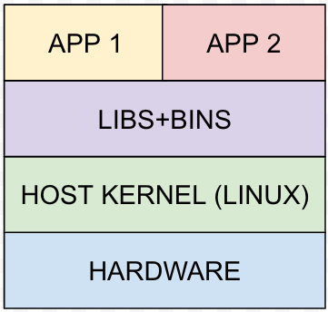
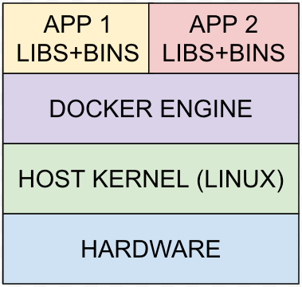

# How To Dockerise Machine Learning Code

This repository contains code and reading material that shows how to wrap up Machine Learning models in a Docker image.

## What is Docker?

Docker is a containerisation platform. But what does this mean?

To understand this better, we need to understand how normal files run in an operation systems.

For example, when we run an app by executing a binary executable file (BIN) on an operating system, it can:

- Make calls to operating system directly
- Make calls to a set of libraries (LIBS) that internally make calls to operating system

A containerisation platform, however, runs the same apps within an environment in which only those LIBS and BINS are accessible that are considered to be necessary by the developers to run relevant app. The image below shows how each app has its own LIBS+BINS in its environment.

***Note:** Drivers are operating system modules, therefore, containers can not contain drivers as LIBS+BINS. For example, when using GPU for training a Machine Learning model, the drivers are installed in the host operating system.*

### What is a container?

A container is an environment that contains LIBS+BINS that are deemed necessary by the developers for running an application.

### What is an image?

An image is a snapshot of an environment with all the LIBS+BINS that are deemed necessary by the developers for running an app.

### How do containers and images relate?

An image can be used as a starting point for a container. One can execute commands in a container which uses an image as a starting point.
